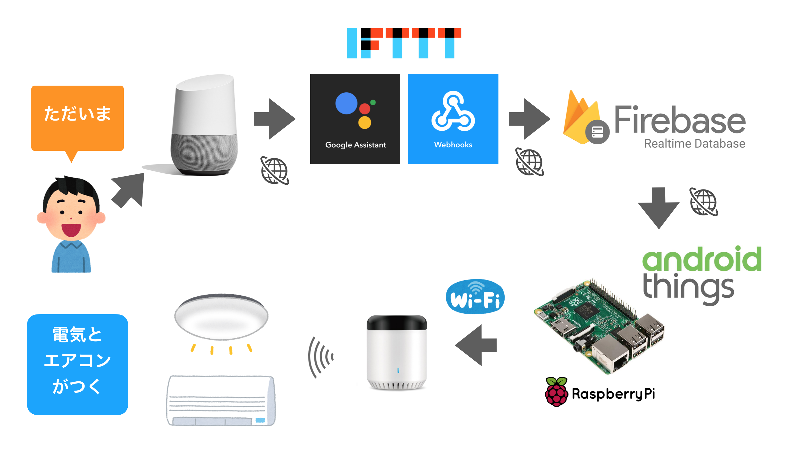

# ERemoteThingsSample

A sample project sending data to eRemote mini (Broadlink RM mini3) from Android Things with Firebase Realtime Database.

https://speakerdeck.com/kumamotone/google-home-to-android-things-dejia-dian-wocao-zuo-suru

Note: This program only intended for Japanese words.

## How to use

1. Import using Android Studio.
2. Add a Firebase settings file(locate app/oogle-services.json.
3. Specify your IP address and data in `string.xml`.

